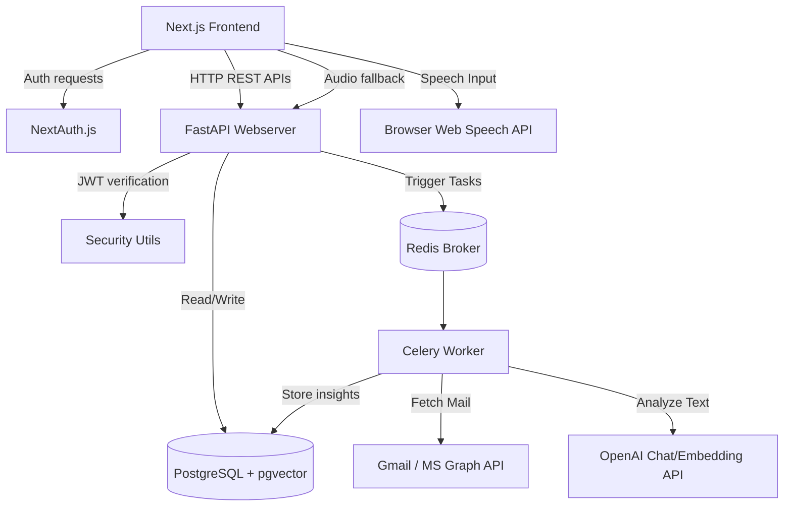

# InboxPilot AI - Voice-based AI Email Assistant

InboxPilot AI is a production-ready, full-stack voice-based email intelligence assistant. It links to your Gmail or Outlook account via OAuth, analyzes and enriches email records with AI models, and enables you to navigate, search, and answer emails using natural voice commands in English or Hindi.

---

## 1. Features
- **OAuth Login Integrations**: Authenticate seamlessly with Google or Microsoft OAuth.
- **Demo / Sandbox Mode**: Run the app locally without developer credentials using realistic, sandbox email records.
- **Celery background queues**: Pull and ingest emails asynchronously.
- **AI-driven Enrichment**:
  - Classifies categories (Work, Personal, Finance, Education, Security, Invoices, Meetings, etc.).
  - Computes urgency and importance metrics.
  - Extracts checklist action items and calendars deadlines.
  - Formulates simple explanations ( beginner-friendly English & Hindi translation).
- **Hybrid Search Engine**: Traditional full-text keyword filtering combined with `pgvector` semantic vector search.
- **Web Speech & Whisper Audio Transcriber**: Speech recognition in browser (Web Speech API) with automatic audio upload fallback to backend Whisper.
- **Voice command intent parsing**: Converts "Find unread emails from college about exams" into SQL database filters.
- **AI Suggestive Replies**: Generates 3 reply options (English/Hindi) and sends them directly via Gmail or Outlook API.

---

## 2. Tech Stack

### Frontend
- Next.js 14 (App Router)
- TypeScript
- Tailwind CSS
- NextAuth.js v5 (Auth.js)
- React Query (TanStack Query)
- Axios Client

### Backend
- FastAPI (Python 3.11+)
- PostgreSQL with `pgvector` extension
- Redis & Celery (Queue processing)
- SQLAlchemy 2.0 & asyncpg (Async Database layer)
- OpenAI API (GPT-4o & text-embedding-3-small)

---

## 3. Architecture



---

## 4. Folder Structure
```txt
inboxpilot-ai/
├── frontend/
│   ├── app/                 # Next.js App Router
│   ├── components/          # Reusable UI widgets
│   ├── lib/                 # Hooks, auth handlers, api clients
│   └── Dockerfile
├── backend/
│   ├── app/
│   │   ├── db/              # SQLAlchemy config & init
│   │   ├── models/          # SQL database schema models
│   │   ├── schemas/         # Pydantic schemas
│   │   ├── routers/         # REST API endpoints
│   │   ├── services/        # Email APIs, AI, embeddings, search
│   │   ├── tasks/           # Celery tasks
│   │   └── utils/           # Encryption, parsing, security
│   ├── tests/               # Pytest suite
│   ├── requirements.txt
│   └── Dockerfile
├── docker-compose.yml
└── README.md
```

---

## 5. Local Setup & Docker Installation

### Prerequisite Checklist
- **Docker & Docker Compose** installed.
- **OpenAI API Key** (optional, mock mode will run if empty).
- **Google / Microsoft Client IDs** (optional, Demo Mode credentials provider runs if empty).

### Running via Docker Compose (Recommended)
1. Copy and configure the environment files:
   ```bash
   cp .env.example .env
   ```
2. Build and launch all containers:
   ```bash
   docker compose up --build
   ```
3. Access the services:
   - **Frontend UI**: [http://localhost:3000](http://localhost:3000)
   - **Backend API Docs**: [http://localhost:8000/docs](http://localhost:8000/docs)
   - **Celery Task Monitor (Flower)**: [http://localhost:5555](http://localhost:5555)

### Running Manually for Development
#### 1. Setup Backend
```bash
cd backend
python -m venv venv
source venv/Scripts/activate # On Windows: venv\Scripts\activate
pip install -r requirements.txt
python -m app.db.init_db # Enables pgvector and creates tables
uvicorn app.main:app --reload
```

#### 2. Run Celery Worker (In a separate terminal)
```bash
celery -A app.tasks.celery_app worker --loglevel=info
```

#### 3. Setup Frontend
```bash
cd frontend
npm install
npm run dev
```

---

## 6. Developer Console Registrations (OAuth)

### A. Google Cloud Developer Console (Gmail)
1. Go to the [Google Cloud Console](https://console.cloud.google.com/).
2. Create a new project and navigate to the **OAuth Consent Screen**. Select **External**.
3. Add the following scopes:
   - `openid`, `email`, `profile`
   - `https://www.googleapis.com/auth/gmail.readonly`
   - `https://www.googleapis.com/auth/gmail.send`
4. Go to **Credentials**, click **Create Credentials** -> **OAuth Client ID**. Select **Web Application**.
5. Set:
   - **Authorized JavaScript Origins**: `http://localhost:3000`
   - **Authorized Redirect URIs**: `http://localhost:3000/api/auth/callback/google`
6. Copy `GOOGLE_CLIENT_ID` and `GOOGLE_CLIENT_SECRET` into your `.env` file.

### B. Microsoft Azure Portal (Outlook)
1. Go to the [Azure Portal](https://portal.azure.com/) and search for **App Registrations**.
2. Register a new web application. Set Redirect URI to Web: `http://localhost:3000/api/auth/callback/microsoft-entra-id`.
3. In **API Permissions**, add Microsoft Graph delegated permissions:
   - `openid`, `email`, `profile`, `offline_access`
   - `Mail.Read`, `Mail.Send`
   - Click **Grant Admin Consent**.
4. Go to **Certificates & Secrets**, create a new client secret and copy its value.
5. Copy `MICROSOFT_CLIENT_ID` and `MICROSOFT_CLIENT_SECRET` into your `.env` file.

---

## 7. Database Table Schemas

### users
- `id`: UUID Primary Key
- `email`: unique string (index)
- `name`: string
- `provider`: string (google/microsoft)
- `access_token`: encrypted text
- `refresh_token`: encrypted text
- `preferred_language`: string (en/hi)

### emails
- `id`: UUID Primary Key
- `user_id`: UUID Foreign Key referencing users
- `subject`: text
- `sender_email` & `sender_name`: string
- `category`: string (index)
- `urgency_score` & `importance_score`: float
- `summary` & explanations: text
- `action_items` & `deadlines`: JSONB
- `embedding`: vector(1536) for semantic lookup

---

## 8. REST API Endpoints

| Method | Endpoint | Description | Auth Required |
| :--- | :--- | :--- | :--- |
| `GET` | `/health` | Systems check | No |
| `POST` | `/api/v1/auth/oauth-login` | Synchronize User & OAuth tokens | No |
| `GET` | `/api/v1/auth/me` | Fetch session user details | Yes |
| `PATCH` | `/api/v1/auth/preferences` | Update preferred translation language | Yes |
| `GET` | `/api/v1/emails` | List filtered emails | Yes |
| `GET` | `/api/v1/emails/search` | Full Text / Vector search query | Yes |
| `POST` | `/api/v1/emails/sync` | Trigger async mailbox sync | Yes |
| `GET` | `/api/v1/emails/sync/status/{id}` | Read sync progress state | Yes |
| `POST` | `/api/v1/emails/{id}/reply` | Send email reply draft | Yes |
| `POST` | `/api/v1/voice/transcribe` | Whisper STT file upload fallback | Yes |
| `POST` | `/api/v1/voice/command` | Parse voice command filters | Yes |
| `GET` | `/api/v1/insights/dashboard` | Compile aggregate stats | Yes |

---

## 9. Security Implementations
- **Fernet Token Encryption**: All OAuth credentials are encrypted symmetrically before database storage, protecting user API secrets.
- **JWT Authorization**: All backend routes (except health & login) require valid bearer token authorization.
- **XSS Script Stripping**: Email body contents are parsed, removing raw script blocks to prevent cross-site scripting vulnerabilities.

---

## 10. Verification Tests

### Run Backend Pytest Suite
```bash
cd backend
pytest
```

### Run Frontend Vitest Suite
```bash
cd frontend
npm run test # or npx vitest
```
